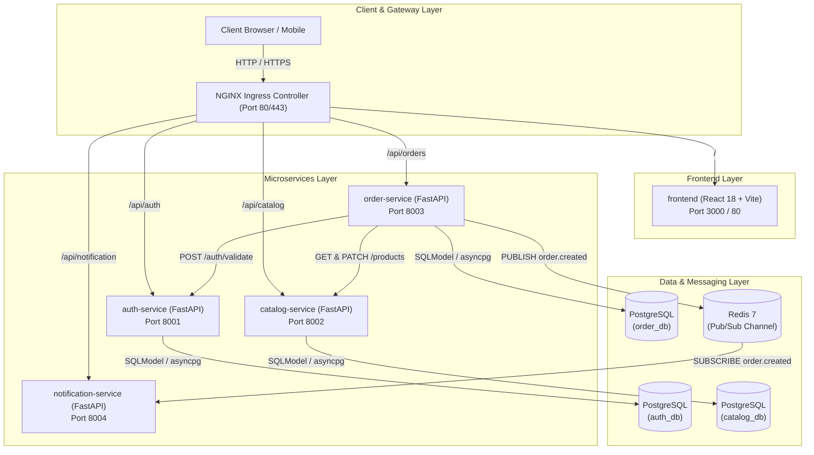
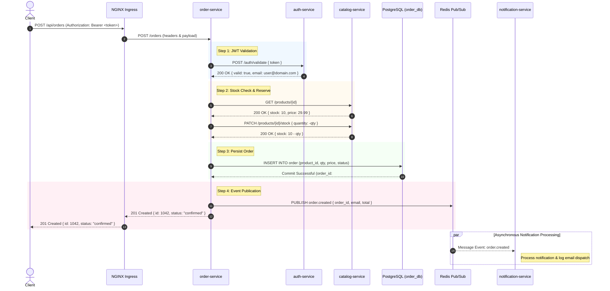

# OrbitStack Architecture & Design

OrbitStack is built as a cloud-native microservices platform demonstrating production patterns across API design, authentication, event-driven messaging, data isolation, and Kubernetes orchestration.

---

## 1. System Architecture

The diagram below illustrates the component topology, showing client traffic entering through the **NGINX Ingress Controller**, routing to backend services and the frontend client, and communicating with isolated storage and messaging layers.

---

## 2. Order Placement Sequence Diagram

The sequence diagram below details the synchronous inter-service orchestration and asynchronous event publishing during an order placement call (`POST /orders`).

---

## 3. Key Design Patterns

### Database-per-Service Isolation
Each microservice manages its own schema and database (`auth_db`, `catalog_db`, `order_db`). Services interact strictly via defined REST APIs or event contracts, eliminating direct cross-database queries.

### Asynchronous Event-Driven Messaging
Order creation is decoupled from notification delivery. `order-service` publishes an `order.created` event to Redis. `notification-service` consumes events asynchronously, preserving low latency for order execution.

### Unified Ingress Routing
External traffic is routed through the NGINX Ingress controller using declarative path rules (`/api/auth`, `/api/catalog`, `/api/orders`, `/api/notification`, `/`), providing a single gateway for the entire platform.
